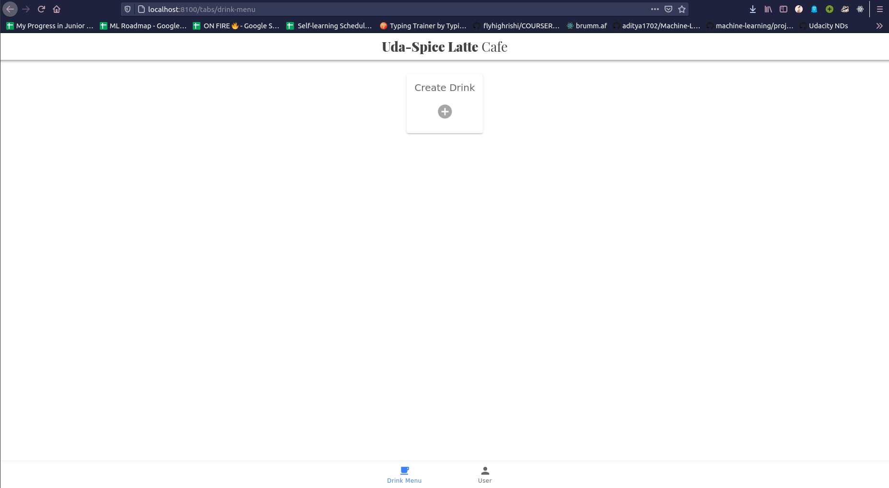
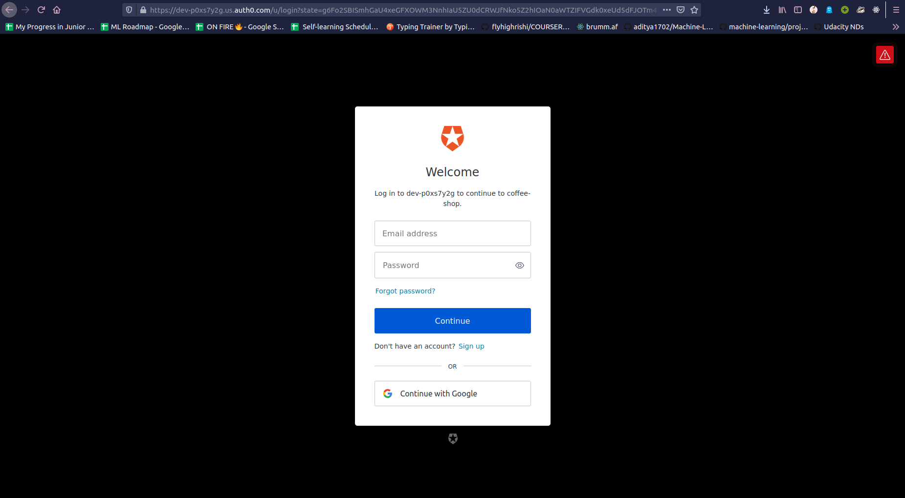

# Coffee Shop Backend
A full stack drink menu application that does the following:
1) Display graphics representing the ratios of ingredients in each drink.
2) Allow public users to view drink names and graphics.
3) Allow the shop baristas to see the recipe information.
4) Allow the shop managers to create new drinks and edit existing drinks.

This application focus on Authentication and Authorization using [Auth0](https://auth0.com/)

## Screenshots
**Home page for authorized user**



**login/signup using Auth0**


## Getting Started

### Installing Back end Dependencies

#### Python 3.7

Follow instructions to install the latest version of python for your platform in the [python docs](https://docs.python.org/3/using/unix.html#getting-and-installing-the-latest-version-of-python)

#### Virtual Enviornment

Instructions for setting up a virual enviornment for your platform can be found in the [python docs](https://packaging.python.org/guides/installing-using-pip-and-virtual-environments/)

#### PIP Dependencies

Once you have your virtual environment setup and running, install dependencies by naviging to the `/backend` directory and running:

```bash
pip install -r requirements.txt
```


##### Key Dependencies

- [Flask](http://flask.pocoo.org/)  is a lightweight backend microservices framework. Flask is required to handle requests and responses.
- [SQLAlchemy](https://www.sqlalchemy.org/) and [Flask-SQLAlchemy](https://flask-sqlalchemy.palletsprojects.com/en/2.x/) are libraries to handle the lightweight sqlite database.
- [jose](https://python-jose.readthedocs.io/en/latest/) JavaScript Object Signing and Encryption for JWTs. Useful for encoding, decoding, and verifying JWTS.

### Installing Front end Dependencies
#### Installing Node and NPM

Download and install Node (the download includes NPM) from [https://nodejs.com/en/download](https://nodejs.org/en/download/).

#### Installing Ionic Cli

The Ionic Command Line Interface is required to serve and build the frontend. Instructions for installing the CLI  is in the [Ionic Framework Docs](https://ionicframework.com/docs/installation/cli).

#### Installing project dependencies

open your terminal and run:

```bash
npm install
```

>_tip_: **npm i** is shorthand for **npm install**


## Running
#### Backend
From within the `./src` directory first ensure you are working using your created virtual environment.

Each time you open a new terminal session, run:

```bash
export FLASK_APP=api.py;
```

To run the server, execute:

```bash
flask run --reload
```

The `--reload` flag will detect file changes and restart the server automatically.

#### Frontend
cd into the `frontend` directory and run:

```bash
ionic serve
```

## Testing with Postman

[Postman](https://getpostman.com). 

- Import the postman collection `./starter_code/backend/udacity-fsnd-udaspicelatte.postman_collection.json`
- Run the collection
